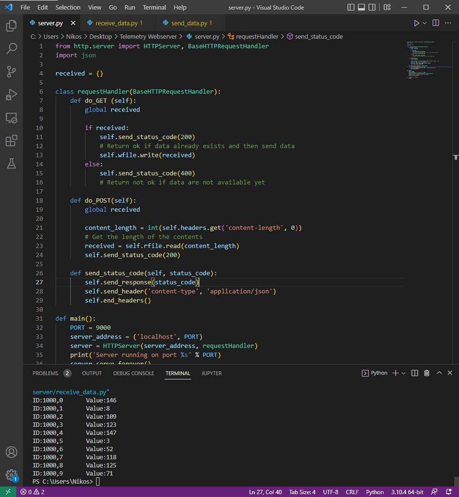

# Telemetry with server

Το Arduino στο αυτοκίνητο θα κάνει τα εξής πράγματα συνέχεια:

* Read a CAN Message
* Send as JSON with HTML POST containing:
	* CAN ID
	* CAN Compound ID
	* CAN Payload

Ο server θα αποθηκεύει στην μνήμη του τις τιμές που λαμβάνει και το πρόγραμμα της τηλεμετρίας θα επικοινωνεί μέσω HTML GET για να πάρει αυτές τις τιμές που θα είναι κωδικοποιημένες σε JSON μορφή.

Τόσο στην Python όσο και στο Arduino υπάρχουν βιβλιοθήκες για κωδικοποίηση / αποκωδικοποίηση από/σε JSON

## Screenshots

